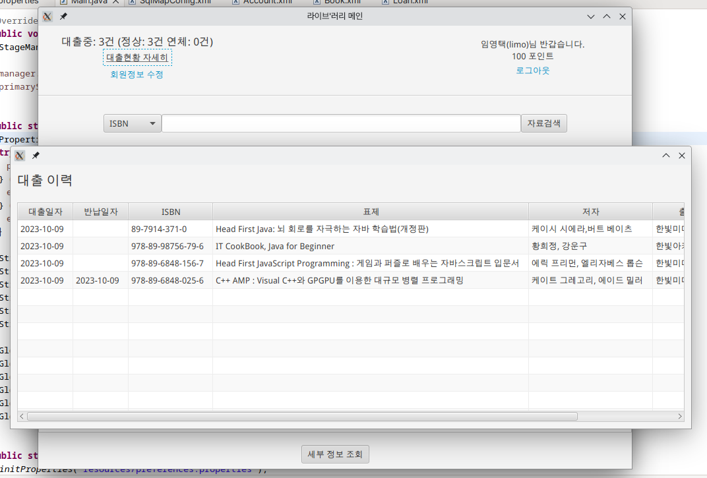

# 라이브' 러리 (live/rary)




JavaFX를 이용한 소규모 도서관 시스템 구축 실습

[v0.2] MyBatis 적용  
[v0.1] 기본 기능 구현 완료

## 빌드 환경
- JDK 11.x
- JavaFX 11.x
- MyBatis 3.x
- mysql-connector-j-8.0.31
- retrofit2 (및 의존 라이브러리)

## 빌드 인스트럭션

### 요약

1. MySQL [스크립트](./docs/base.sql) 실행
2. 데이터베이스 [접속 정보](./project/liverary/resources/driver.properties) 수정
3. 빌드환경의 라이브러리를 모두 Build Path에 지정
4. 빌드
5. 기본 계정:
   - [사서] 아이디: admin 비밀번호: admin
   - [이용자] 아이디: limo 비밀번호: 980408

### 자세히

1. 도커로 MySQL을 띄우고 base.sql을 실행합니다.

```
liverary/docker # docker compose up
```

2. 이클립스로 프로젝트를 열고 오류가 없는지 확인합니다. 모듈 패스(JavaFX)와 빌드 패스(그 외 라이브러리)가 잘 잡혀있어야 합니다. 각 라이브러리는 [project/liverary/lib](./project/liverary/lib)에 있습니다.

3. 데이터베이스 [접속 정보](./project/liverary/resources/driver.properties)를 수정합니다. 1번의 도커 컴포즈 스크립트를 그대로 사용하여 MySQL를 띄운 경우 수정하지 않아도 됩니다.

4. 설정 파일 템플릿 ([preferences.properties.example](./project/liverary/resources/preferences.properties.example))을 preferences.properties라는 이름으로 복사하여 알맞게 수정합니다. 국립중앙도서관 OpenAPI 키는 [여기](https://www.nl.go.kr/NL/contents/N31101010000.do)에서 발급할 수 있습니다.

5. 빌드 후 실행합니다. 실행시 JVM에 옵션을 지정해야 JavaFX 관련 모듈이 로드됩니다. 이클립스에서 Run Configurations를 열어 Arguments에 다음을 추가하세요. --module-path 값은 적절히 수정하세요.

```
--module-path "~/git/liverary/project/liverary/lib/openjfx-11.0.2_linux-x64_bin-sdk/javafx-sdk-11.0.2/lib" --add-modules javafx.controls,javafx.fxml
```


## 시나리오
이 어플리케이션의 사용자는 사서와 도서관 이용자로 나누어 집니다.

도서관 이용자는 도서관에 비치된 자료 검색 PC 등을 통해 이 어플리케이션에 접근할 수 있으며, 개인 대출 이력 조회 / 개인 정보 수정 / 자료 검색 및 대출 가능 여부 확인 등의 한정된 기능만을 이용할 수 있습니다.

이용자가 대출/반납을 희망할 때에는, 실물 자료를 가지고 사서에게 찾아가 요청하면 됩니다. 사서는 본인의 계정으로 어플리케이션에 접속해 대출 및 반납 처리를 수행할 수 있습니다.

## 기능
- 로그인
  - 회원가입
  - 계정에 지정된 권한(0: 이용자 / 1이상: 사서)에 따라 이용자 뷰나 사서 뷰로 전환
- 사서
  - 열람업무 - 반납/대출 (기본뷰)
  - 열람업무 - 최근이용이력
  - 열람업무 - 미반납자료조회
  - 수서업무 - 자료입수
  - 자료관리 - 자료상세조회
  - 자료관리 - 서지사항수정
  - 회원관리 - 직원등록
  - 회원관리 - 직원조회/수정
- 이용자
  - 대출희망자료 검색 (기본뷰)
  - 대출 이력 확인
  - 회원 정보 수정 / 탈퇴
  - 
### 이용 정책
- 포인트가 0 미만인 이용자는 추가 대출할 수 없습니다.
- 이용자는 자료를 반납 기일 내 정상 반납한 경우 소정의 포인트를 얻을 수 있습니다. ([preferences.properties](https://github.com/0tak2/liverary/blob/main/project/liverary/resources/preferences.properties.example))
- 이용자는 연체 반납시 일정 포인트를 잃게 됩니다. ([preferences.properties](https://github.com/0tak2/liverary/blob/main/project/liverary/resources/preferences.properties.example))
- 그 외에도 최대 대출 한도(최대로 동시에 빌릴 수 있는 자료의 개수)를 지정할 수 있습니다. ([preferences.properties](https://github.com/0tak2/liverary/blob/main/project/liverary/resources/preferences.properties.example))
